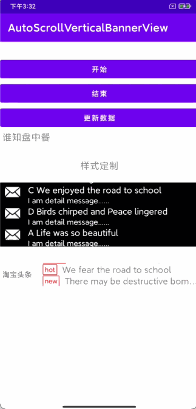

该项目是`git clone https://github.com/guojunustb/VerticalBannerView`基础上进行修改和开发。

# 修改点：

1. 升级`gradle`环境，使项目可运行；
2. `Androidx`升级，去掉`demo`多余功能；
3. 支持展示多个并一起滑出；
4. 支持展示多个，部分一起滑出；
5. 滑动时间与间隔时间的设置方法修改为代码设置动态设置；
6. 使用无需引导`maven`仓库，直接将`AutoScrollVerticalBannerView`这一个类拷贝到项目就可以运行或二次开发；

# AutoScrollVerticalBannerView

`AutoScrollVerticalBannerView`是一个android平台下的自定义控件,通常用来展示广告,类似`淘宝头条`,它的样式如下:



### Feature

1. 可自由定义展示的内容
2. 使用方式类似ListView/RecyclerView
3. 可为当前的内容添加各种事件,比如点击打开某个页面等

### Attention

`API >= 11`

### Usage

可以类比`ListView`

0. 定义item的布局


```xml
<?xml version="1.0" encoding="utf-8"?>
<RelativeLayout xmlns:android="http://schemas.android.com/apk/res/android"
              android:orientation="vertical"
              android:layout_width="match_parent"
              android:background="#000"
                android:gravity="center_vertical"
              android:layout_height="60dp">

    <ImageView
        android:layout_marginLeft="10dp"
        android:id="@+id/iv"
        android:src="@android:drawable/ic_dialog_email"
        android:layout_width="30dp"
        android:layout_height="30dp"
        />

    <TextView
        android:id="@+id/tv_02"
        android:text="hello world"
        android:layout_marginLeft="10dp"
        android:textSize="16sp"
        android:layout_toRightOf="@id/iv"
        android:paddingLeft="5dp"
        android:textColor="#fff"
        android:layout_width="match_parent"
        android:layout_height="wrap_content"/>

    <TextView
        android:layout_below="@id/tv_02"
        android:text="I am detail message......"
        android:layout_marginLeft="10dp"
        android:textSize="14sp"
        android:layout_centerVertical="true"
        android:layout_toRightOf="@id/iv"
        android:paddingLeft="5dp"
        android:textColor="#fff"
        android:layout_width="match_parent"
        android:layout_height="wrap_content"/>
</RelativeLayout>
```

1. 实现adapter

```java
public class SampleAdapter01 extends BaseBannerAdapter<Model01> {
    private List<Model01> mDatas;
    public SampleAdapter01(List<Model01> datas) {
        super(datas);
    }
    @Override
    public View getView(VerticalBannerView parent) {
        return LayoutInflater.from(parent.getContext()).inflate(R.layout.item_01,null);
    }
    @Override
    public void setItem(final View view, final Model01 data) {
        TextView tv = (TextView) view.findViewById(R.id.tv_01);
        tv.setText(data.title);
        //你可以增加点击事件
        view.setOnClickListener(new View.OnClickListener() {
            @Override
            public void onClick(View v) {
                //比如打开url
                Toast.makeText(view.getContext(),data.url,Toast.LENGTH_SHORT).show();
            }
        });
    }
    //设置视图需要展示的item个数
    @Override
    public int getScrollBannerCount() {
        return 2;
    }
	//设置一次需要向上滚动的item个数
    @Override
    public int getShowBannerCount() {
        return 2;
    }
}
```

2. 在布局中增加view的声明

```java
   <com.tzx.autoscrollverticalbannerview.AutoScrollVerticalBannerView
            android:id="@+id/banner_01"
            android:layout_width="match_parent"
            android:layout_height="40dp"/>
```

3. 设置Adapter并启动

```java
List<Model01> datas02 = new ArrayList<>();
datas02.add(new Model01("Life was so beautiful","--->Life was so beautiful,"));
datas02.add(new Model01("From morning to evening","--->From morning to evening"));
datas02.add(new Model01("We enjoyed the road to school","--->We enjoyed the road to school,"));
datas02.add(new Model01("Birds chirped and Peace lingered","--->Birds chirped and Peace lingered"));
final SampleAdapter02 adapter02 = new SampleAdapter02(datas02);
final VerticalBannerView banner02 = (VerticalBannerView) findViewById(R.id.banner_02);
banner02.setAdapter(adapter02);
banner02.setGap(2000);//切换时长2000ms
banner02.setAnimDuration(1000);//动画间隔1000ms
banner02.start();
```

4. 更新数据

```java
List<Model01> newData = new ArrayList<>();
newData.add(new Model01("锄禾日当午","--->锄禾日当午"));
newData.add(new Model01("汗滴禾下土","--->汗滴禾下土"));
newData.add(new Model01("谁知盘中餐","--->谁知盘中餐"));
newData.add(new Model01("粒粒皆辛苦","--->粒粒皆辛苦"));
adapter02.setData(newData);
```

5. 停止

```java
banner02.stop();
```